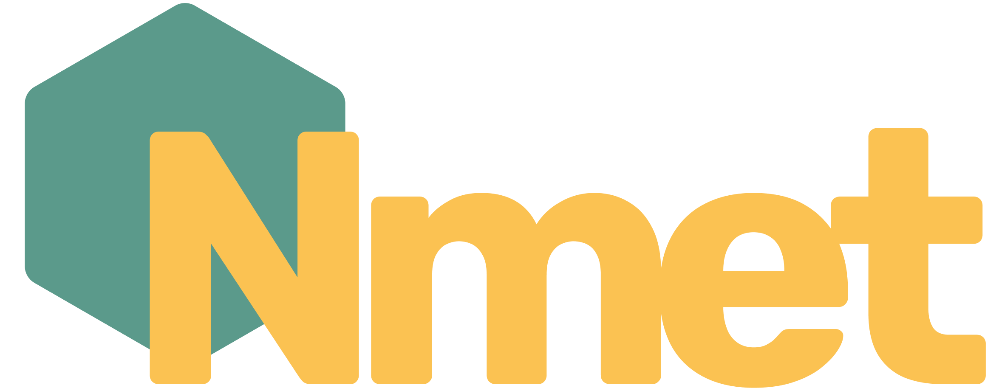

<a name="readme-top"></a>

[![Contributors][contributors-shield]][contributors-url]
[![Forks][forks-shield]][forks-url]
[![Stargazers][stars-shield]][stars-url]
[![Issues][issues-shield]][issues-url]
[![MIT License][license-shield]][license-url]
[![LinkedIn][linkedin-shield]][linkedin-url]

<!-- PROJECT LOGO -->
<br />
<div align="center">
  <a href="https://github.com/mahanfr/Nmet">
    
  </a>

  <br />
  <p align="center">
    A general purpose statically typed and compiled programming language 
    <br />
    <a href="https://github.com/mahanfr/nemet/issues">Report Bug</a>
    ·
    <a href="https://mahanfr.github.io/Nmet/">Documentaion</a>
  </p>
</div>

## About The Project

A General Purpose Compiled Programming Language that compiles to x86-64 ELF object file or Nasm compatable asm text file.
This compiler can directly generate x86-64 Elf file using it's internal assembler whitout any thirdparty tool or library!

Language is not compelete in the current state and lacks any convenient tools for making real world applications but feel free to check out the [examples](./examples)
that shows Some of the Nmet programming language capabilities.

Use the `docs/README.md` to get started.

See the [open issues](https://github.com/othneildrew/Best-README-Template/issues) for a full list of proposed features (and known issues).

## Quick Start
The Project is in development state and dose not come with a package yet and **It is Only available fot linux** but you can use wsl in windows!
<br />
For getting started clone the repository and build the project using Rust toolchain
<br />
Install [Nasm](https://www.nasm.org/) using your package manager or by downloading it from it's official website
<br />

### Installing
For installing in Gnu/Linux system make this projectl.
```shell
$ make install
```

Create a file like ```hello.nmt``` extention and write a simple program insde it:

lets start with a classic application that prints hello world to the standard output
``` nmt
fun main() {
    print "Hello World!\n";
}
```
now you can run the following commands:

``` shell
$ nmet ./hello.nmt
$ nemt -elf ./hello.nmt
$ ./build/hello
```

## Syntax

In this section we are showcasing different aspects of Nmet syntax
### Starting Point

Every program starts with a function named main. usally this function has no arguments but you can define one with the type list-of-string to gain access to command line arguments.

p.s: Comments are starting with "~" because we hate this character so we made it into a comment

```
~~ No Arguments
func main() {
	...
}
~~ With Arguments
func main(args @[str,?]) {
	...
}
```

### Expressions

Expressions are grammars that can be used in every kind of operation; from mathematical to lists and function calls These expressions are just like in other languages.

### Print
Unlike other system level programming languages Nmet comes with an internal print function, This function dose not require Parentheses and can have as many arguments as you supply it to.
```
print "Hello world!";
print 12 + 6;
```

### Variable Declare
Every programming languages has a way to abstract away direct memory access with variables. In Nmet we define variables with "var" keyword followed by a name. All types in Nmet are indicated by the at-sign symbol. Adding type to variables is optional as long as you provide an initial value. Nmet also supports const variables which can be declared by adding a colon behind the question mark.
```
var list @[char,12];
var x @int = 10
~~ auto casting and const
var is_true := true;
```

### Variable Assignment

Assigning values to a variable is a process which you can transfer result of your processes to a predefined memory In Nmet we have different types of assignments including add and assign or divide and assign which is represented in the code below:
```
a = 10; ~~ a <- 10
a += 10; ~~ a <- a + 10
a -= 10; ~~ a <- a - 10
a *= 10; ~~ a <- a * 10
a /= 10; ~~ a <- a / 10
a %= 10; ~~ a <- a % 10
```

### Loops
loops are one of the most important parts of any programming language. Nmet loops are defined using the while keyword followed by a condition which indicates when the looping ends pretenses surrounding the condition is optional.
```
while a < 10 {
	...
}
```

### Conditions
if statements allow the user of the programming language to run some parts of the code conditionally. You can use if statements by writing the if keyword followed by the condition and with optional else and else if.
```
if a < 10 {
	...
} else if a > 10 {
	...
} else {
	...
}
```

### Inline Asm
because Nmet is a low level language having a way to write in line assembly is essential for the usability of it. Inline assembly codes can be defined in a block marked by asm keyword. each assembly line is surrounded by double quotes. You can use Nmet declared variables inside the assembly lines by using the percentage sign. Make sure to use correct registers for different variable types .
```
asm {
	"mov rax, %my_u64_variable"
	"inc rax"
}
```

## Contributing
Contributions are what make the open source community such an amazing place to learn, inspire, and create. Any contributions you make are **greatly appreciated**.

If you have a suggestion that would make this better, please fork the repo and create a pull request. You can also simply open an issue with the tag "enhancement".
Don't forget to give the project a star! Thanks again!

1. Fork the Project
2. Create your Feature Branch (`git checkout -b feature/AmazingFeature`)
3. Commit your Changes (`git commit -m 'Add some AmazingFeature'`)
4. Push to the Branch (`git push origin feature/AmazingFeature`)
5. Open a Pull Request

## License

Distributed under the MIT License. See `LICENSE.txt` for more information.


[contributors-shield]: https://img.shields.io/github/contributors/mahanfr/Nmet.svg?style=for-the-badge
[contributors-url]: https://github.com/mahanfr/Nmet/graphs/contributors
[forks-shield]: https://img.shields.io/github/forks/mahanfr/Nmet.svg?style=for-the-badge
[forks-url]: https://github.com/mahanfr/Nmet/network/members
[stars-shield]: https://img.shields.io/github/stars/mahanfr/Nmet.svg?style=for-the-badge
[stars-url]: https://github.com/mahanfr/Nmet/stargazers
[issues-shield]: https://img.shields.io/github/issues/mahanfr/Nmet.svg?style=for-the-badge
[issues-url]: https://github.com/mahanfr/Nmet/issues
[license-shield]: https://img.shields.io/github/license/mahanfr/Nmet.svg?style=for-the-badge
[license-url]: https://github.com/mahanfr/Nmet/blob/master/LICENSE.txt
[linkedin-shield]: https://img.shields.io/badge/-LinkedIn-black.svg?style=for-the-badge&logo=linkedin&colorB=555
[linkedin-url]: https://linkedin.com/in/mahanfarzaneh
[product-screenshot]: assets/nemet.png
