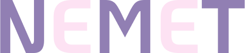

[![Contributors][contributors-shield]][contributors-url]
[![Forks][forks-shield]][forks-url]
[![Stargazers][stars-shield]][stars-url]
[![Issues][issues-shield]][issues-url]
[![MIT License][license-shield]][license-url]
[![LinkedIn][linkedin-shield]][linkedin-url]

<!-- PROJECT LOGO -->
 

  

  <h3 align="center">NeMeT</h3>

  

    A Programming language that you can not code into
     
    <a href="https://github.com/mahanfarzaneh2000/nemet"><strong>Explore the docs »</strong></a>
     
     
    <a href="https://github.com/mahanfarzaneh2000/nemet">View Demo</a>
    ·
    <a href="https://github.com/mahanfarzaneh2000/nemet/issues">Report Bug</a>
    ·
    <a href="https://github.com/mahanfarzaneh2000/nemet/issues">Request Feature</a>
  

## About The Project

A General Purpose Programming Language that you **Should Not** Program into. Inspierd by Rust, Zig and Odin But **it will not support** any additional library 
unless you have the code next to your code files. The Reson for this rather strange restriction is to be more conscious of the codes we use in our programs.

Use the `docs/README.md` to get started.

## Roadmap

- [x] Tokenize block of code
- [ ] Read command line arguments
- [ ] Parse tokens and generate ast
    - [x] function
    - [x] variable definition
    - [x] operation
    - [ ] if statments
    - [ ] loops
    - [ ] structs
    - [ ] include
- [ ] Compile to assambly
- [ ] Test it!
- [ ] Optimize
- [ ] Bootstrap

See the [open issues](https://github.com/othneildrew/Best-README-Template/issues) for a full list of proposed features (and known issues).

## Contributing

Contributions are what make the open source community such an amazing place to learn, inspire, and create. Any contributions you make are **greatly appreciated**.

If you have a suggestion that would make this better, please fork the repo and create a pull request. You can also simply open an issue with the tag "enhancement".
Don't forget to give the project a star! Thanks again!

1. Fork the Project
2. Create your Feature Branch (`git checkout -b feature/AmazingFeature`)
3. Commit your Changes (`git commit -m 'Add some AmazingFeature'`)
4. Push to the Branch (`git push origin feature/AmazingFeature`)
5. Open a Pull Request

## License

Distributed under the MIT License. See `LICENSE.txt` for more information.

[contributors-shield]: https://img.shields.io/github/contributors/mahanfarzaneh2000/nemet.svg?style=for-the-badge
[contributors-url]: https://github.com/mahanfarzaneh2000/nemet/graphs/contributors
[forks-shield]: https://img.shields.io/github/forks/mahanfarzaneh2000/nemet.svg?style=for-the-badge
[forks-url]: https://github.com/mahanfarzaneh2000/nemet/network/members
[stars-shield]: https://img.shields.io/github/stars/mahanfarzaneh2000/nemet.svg?style=for-the-badge
[stars-url]: https://github.com/mahanfarzaneh2000/nemet/stargazers
[issues-shield]: https://img.shields.io/github/issues/mahanfarzaneh2000/nemet.svg?style=for-the-badge
[issues-url]: https://github.com/mahanfarzaneh2000/nemet/issues
[license-shield]: https://img.shields.io/github/license/mahanfarzaneh2000/nemet.svg?style=for-the-badge
[license-url]: https://github.com/mahanfarzaneh2000/nemet/blob/master/LICENSE.txt
[linkedin-shield]: https://img.shields.io/badge/-LinkedIn-black.svg?style=for-the-badge&logo=linkedin&colorB=555
[linkedin-url]: https://linkedin.com/in/mahanfarzaneh
[product-screenshot]: assets/nemet.png
